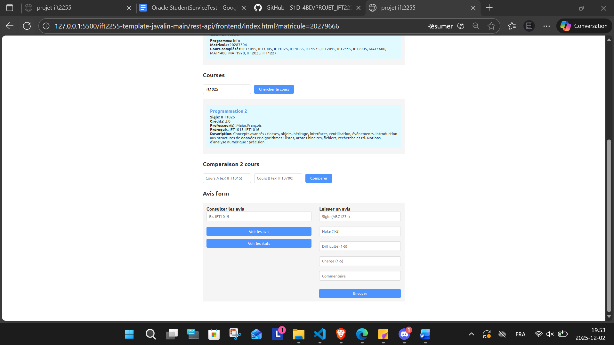
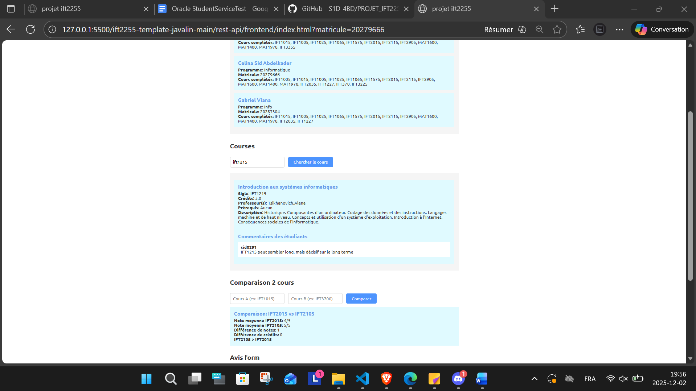

# Instructions pour lancer l'outil + tests

Plateforme web permettant aux étudiants de l’UdeM, notamment au DIRO, de choisir leurs cours de manière fiable et anonyme. Le système combine des données officielles (Planifium, résultats académiques, prérequis, horaires) et des avis étudiants anonymisés (via Discord). Il propose des fonctionnalités de recherche avancée, comparaison multi-cours, consultation de fiches des cours détaillées, et recommandations en fonction des preférences de l'utilisateur.

- **Équipe** – Celina Sid Abdelkader, Aya Dair, Gabriel Viana, Hamza Ali Ousalah

## Prérequis

Assurez-vous d’avoir les outils suivants installés :

- Python **3.11** ou plus récent
- `pip` (gestionnaire de paquets Python)
- `pipenv` ou équivalent (gestion d’environnement virtuel)

## Pour lancer le backend

- Se déplacer jusqu'au répertoire `PROJET_IFT2255_TEMPLATE-main/project/ift2255-template-javalin-main/ift2255-template-javalin-main/rest-api`
- Lancer la commande `mvn clean compile exec:java '-Dexec.mainClass=com.diro.ift2255.Main' ` (on verra le backend en localhost sur port 3000)

## Pour lancer le bot Discord

- **Avoir accepté l'invitation sur le serveur TEST_IFT2255**
- **Avoir téléchargé le fichier dotenv qui contient le token du BOT**
- Se déplacer jusqu'au répertoire `PROJET_IFT2255_TEMPLATE-main/project/ift2255-template-javalin-main/ift2255-template-javalin-main/rest-api`
- lancer l'installation des dépendances avec `pip install -r requirements.txt`
- lancer le script `python discordbot.py`

## Pour voir l'interface 

- Ouvrir `landing.html`
- Entrer un matricule (ex : 20279666)
- Tester

## Pour lancer les tests

- Se déplacer jusqu'au répertoire `PROJET_IFT2255_TEMPLATE-main/project/ift2255-template-javalin-main/ift2255-template-javalin-main/rest-api`
- Lancer mvn test

---
Images 

  
  
  
  
  
  
  
  
  
  
  
